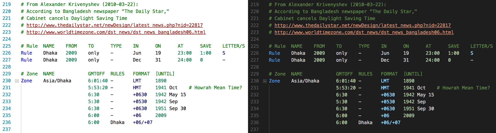

# VSCode zoneinfo

A [Visual Studio Code](https://code.visualstudio.com/) extension that adds syntax highlighting for [IANA time zone database](http://iana.org/time-zones) files (a.k.a. zoneinfo files).

_Also available as a [package for Sublime Text](https://github.com/gilmoreorless/sublime-zoneinfo)._

## Features

Syntax highlighting is provided for the raw time zone definition files:

- africa
- antarctica
- asia
- australasia
- backward
- backzone
- etcetera
- europe
- factory
- northamerica
- pacificnew
- southamerica
- systemv

As well as associated metadata files:

- iso3166.tab
- leap-seconds.list
- leapseconds
- zone.tab
- zone1970.tab

### Example screenshot

## Development

The syntax highlighting rules are defined by the `zoneinfo.tmLanguage` file, which was generated by the [sublime-zoneinfo](https://github.com/gilmoreorless/sublime-zoneinfo) package.

For consistency, any changes to syntax highlighting should be made in sublime-zoneinfo first, then copied to this extension.

## Credits

This code is open source under the [MIT license](LICENSE) – © Gilmore Davidson.
