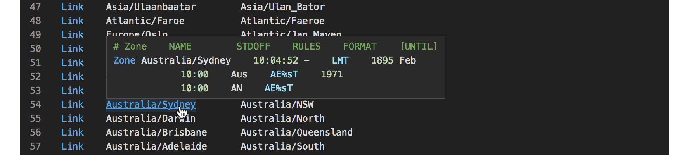
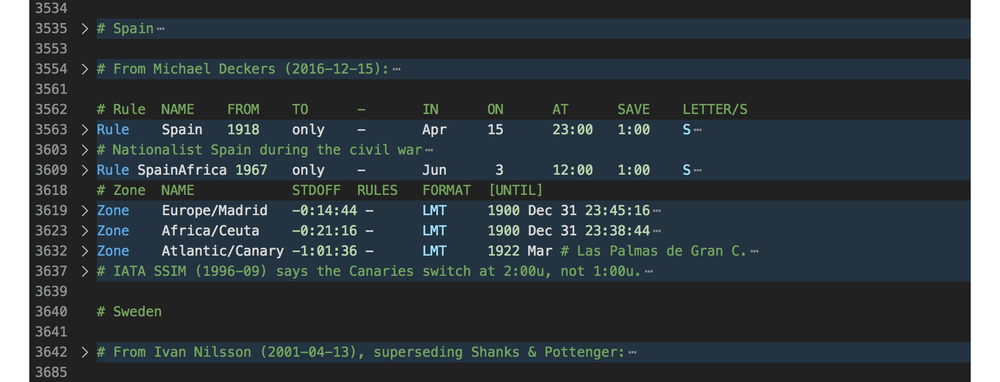

# VSCode zoneinfo

A [Visual Studio Code](https://code.visualstudio.com/) extension that adds syntax highlighting and smart navigation for [IANA time zone database](http://iana.org/time-zones) files (a.k.a. zoneinfo files).

_Also available as a [package for Sublime Text](https://github.com/gilmoreorless/sublime-zoneinfo)._

## Installation

Find it as [Zoneinfo](https://marketplace.visualstudio.com/items?itemName=gilmoreorless.vscode-zoneinfo) in the Visual Studio Marketplace. Within VSCode you can search for `Zoneinfo` in the extensions sidebar.

## Syntax highlighting

Syntax highlighting is provided for the raw time zone definition files:

- africa
- antarctica
- asia
- australasia
- backward
- backzone
- etcetera
- europe
- factory
- northamerica
- pacificnew
- southamerica
- systemv

As well as associated metadata files:

- iso3166.tab
- leap-seconds.list
- leapseconds
- zone.tab
- zone1970.tab

### Example screenshot

## Definition navigation

This plugin provides support for smart navigation within the time zone definition files (listed above).

### Go to symbol

Use the [go to symbol](https://code.visualstudio.com/docs/editor/editingevolved#_go-to-symbol) feature for a single file, or the whole `tz` directory.
“Symbol” here means any `Link`, `Rule`, or `Zone` definition.

Find symbols within a single file:

Find symbols within the `tz` directory/workspace:

### Go to definition

Click-through support between definitions is handled with the [go to definition](https://code.visualstudio.com/docs/editor/editingevolved#_go-to-definition) feature.
Specifically, you are able to go from a `Link` to a `Zone`, and from a `Zone` to a `Rule`.

### Find all references

This is the reverse operation of “go to definition”. Find all references across the workspace to a `Rule` or `Zone` definition.

### Code folding

All multi-line symbols (`Rule` and `Zone` statements) and comment blocks can be folded to reduce clutter.

## Development

The syntax highlighting rules are defined by the `zoneinfo.tmLanguage` file, which was generated by the [sublime-zoneinfo](https://github.com/gilmoreorless/sublime-zoneinfo) package.

For consistency, any changes to syntax highlighting should be made in sublime-zoneinfo first, then copied to this extension.

## Credits

This code is open source under the [MIT license](LICENSE) – © Gilmore Davidson.
